# Nombre: Kevin Nicolas Perez Tobar
# Curso: M6A
# Dinamica de Sistemas
# Clase 3: Algebra de Bloques

# 1. Introducción al Álgebra de Bloques

En el campo de la Dinámica de Sistemas, el álgebra de bloques es una herramienta fundamental y poderosa para el modelado, análisis y diseño de sistemas complejos, especialmente aquellos que involucran múltiples componentes interconectados. Imagina un sistema como una maquinaria intrincada, donde cada pieza (o proceso) tiene una función específica y se relaciona con otras. El álgebra de bloques nos permite representar estas piezas y sus interconexiones de manera gráfica y matemática, simplificando la comprensión de cómo fluye la información y cómo se propagan las señales a través del sistema.

 # 2. Resumen
 
El álgebra de bloques es una herramienta esencial en la Dinámica de Sistemas para modelar, analizar y diseñar sistemas complejos con componentes interconectados. Representa visualmente las funciones de transferencia de los elementos de un sistema y su combinación, mostrando el flujo de información. Cada bloque es una operación que transforma una señal, y las flechas indican la dirección de la señal. Es fundamental en ingeniería de control y procesamiento de señales para comprender cómo las señales se propagan y cómo interactúan los subsistemas.

# 3. Definciones

# 3.1 Que es un de Diagrama de Bloques.

🔑 Definción: Los diagramas de bloques son una herramienta gráfica fundamental que facilita la comprensión de la interacción entr múltiples sistemas o componentes. Históricamente, su desarrollo se atribuye a J. Watt, quien comenzó a utilizarlos para explicar el funcionamiento de su primer sistema de control.

# 3.2 Elementos que componen los Diagramas de Bloques

3.21 🔑 Bloque: Es un símbolo para representar la operación matemática que sobre la señal de entrada hace el bloque para producir la salida.

# Figura 3.21 Representacion grafica de un bloque

3.22 🔑 Flechas: La función principal de una flecha es mostrar el sentido en el que una señal se propaga de un componente a otro. Esto es crucial para entender la causa y efecto dentro del sistema. La señal solo puede ir en la dirección que la flecha indica, nunca en sentido contrario.

3.23 🔑Punto Suma: En el álgebra de bloques, este elemento se encarga de combinar señales, ya sea añadiéndolas o sustrayéndolas. Cada flecha que llega a este punto lleva un signo (+ o −) en su origen, indicando la operación específica que debe realizarse con la señal que transporta (sumar o restar, respectivamente).

3.24 🔑 Ramificación: Un punto de ramificación es aquel a partir del cual la señal de un bloque va de modo concurrente a otros bloques o puntos de suma.

3.25  🔑 Interpretacion del Diagrama 

La salida de un bloque funcional corresponde a la señal de entrada (Dominio s) multiplicada por por la función de
transferencia del bloque. 

# 4. Ejemplos 

💡Ejemplo 4.1 
Vamos a ver como se soluciona los Diagramas de bloques conectados en cascada. 

Las ecuaciones que describen este sistema son:

$$Y_1(s) = U_1(s)G_1(s)$$

$$Y_2(s) = Y_1(s)G_2(s)$$

Sustituyendo $Y_1(s)$ en la segunda ecuación, obtenemos:

$$Y_2(s) = (U_1(s)G_1(s))G_2(s)$$

$$Y_2(s) = U_1(s)G_1(s)G_2(s)$$

💡Ejemplo 4.2
Identificar los elementos de Sistema de la figura.

Los elementos  que podemos ver en el diagrama de bloques son: 

1) 🔑 Flechas: que conectan los elementos entre si, y que apuntan a la derecha son positivos y si apuntan a la izquierda son de orientación negativa.
2) 🔑 Punto de Suma: Aqui podemos que Realiza operaciones (suma o resta) entre señales únicamente.
3) 🔑 Bloques: aca podemos simbolos de la funcion matematica en este caso tenemos una ganancia de bloque G(S).
4) 🔑 Ramificaciones: Aqui podemos ver una ramificacion en 

# 5. Aplicación del Diagrama de Bloques 

## 6. Tabla de las Reglas de Aplicacion

# Reglas de Simplificación de Diagramas de Bloques

| Nº | Diagrama Original | Diagrama Simplificado | Regla de Simplificación |
|----|-------------------|------------------------|--------------------------|
| 1  | 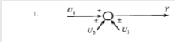 | 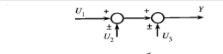 | **Suma de señales:** `Y = U1 ± U2 ± U3` |
| 2  | 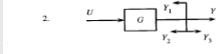 | 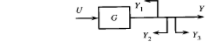 | **Bloque único:** `Y = G·U` |
| 3  | 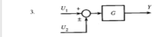 | 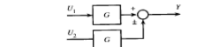 | **Entrada común con bloques en paralelo:** `Y = G·U1 ± U2` |
| 4  | 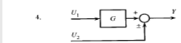 | 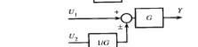 | **Sumador antes del bloque:** `Y = G·(U1 ± U2)` |
| 5  | 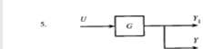 | 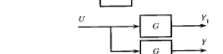 | **Retroalimentación directa:** `Y = Y1` |
| 6  | 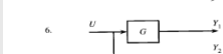 | 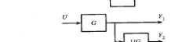 | **Retroalimentación unitaria negativa:** `Y = U / (1 + G)` |
| 7  | 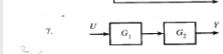 | 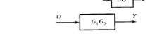 | **Bloques en serie:** `Y = G1·G2·U` |
| 8  | 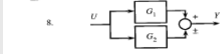 | 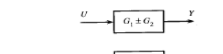 | **Bloques en paralelo:** `Y = (G1 ± G2)·U` |

## 7. Ecuaciones de Lazo de Retroalimentacion positivo

## 🔁 Retroalimentación Positiva

Dado un sistema con retroalimentación positiva:

- \( X(s) \): Entrada del sistema  
- \( Y(s) \): Salida del sistema  
- \( G_1(s) \): Función de transferencia directa  
- \( G_2(s) \): Función de transferencia en la retroalimentación  

### 📐 Ecuaciones del sistema:

$$E(s) = X(s) + Y_1(s)$$

$$Y(s) = E(s) \cdot G_1(s)$$

$$Y_1(s) = Y(s) \cdot G_2(s)$$

Sustituyendo:

$$Y(s) = \left( X(s) + Y_1(s) \right) G_1(s)$$

$$Y(s) = \left( X(s) + Y(s) G_2(s) \right) G_1(s)$$

$$Y(s) = X(s) G_1(s) + Y(s) G_2(s) G_1(s)$$

$$Y(s) \left( 1 - G_2(s) G_1(s) \right) = X(s) G_1(s)$$

## ✅ Función de transferencia del sistema:

$$\frac{Y(s)}{X(s)} = \frac{G_1(s)}{1 - G_2(s) G_1(s)}$$

### Retroalimentación Negativa

Dado el sistema:

$$E(s) = X(s) - Y_1(s)$$

$$Y(s) = E(s) G_1(s)$$

$$Y_1(s) = Y(s) G_2(s)$$

Sustituyendo:

$$Y(s) = \left( X(s) - Y(s) G_2(s) \right) G_1(s)$$

$$Y(s) = X(s) G_1(s) - Y(s) G_2(s) G_1(s)$$

$$Y(s) + Y(s) G_2(s) G_1(s) = X(s) G_1(s)$$

$$Y(s) \left( 1 + G_2(s) G_1(s) \right) = X(s) G_1(s)$$

**Función de transferencia:**

$$\frac{Y(s)}{X(s)} = \frac{G_1(s)}{1 + G_2(s) G_1(s)}$$

## 7.1 Reducción de Diagramas

$$Y_1(s) = G_1 X_1(s) - G_2 X_1(s) = (G_1 - G_2) X_1(s)$$

$$Y_3(s) = G_3 Y_1(s) = G_3 (G_1 - G_2) X_1(s)$$

$$Y_2(s) = G_4 X_2(s) - X_2(s) = (G_4 - 1) X_2(s)$$

$$Y(s) = Y_3(s) + Y_2(s) = G_3 (G_1 - G_2) X_1(s) + (G_4 - 1) X_2(s)$$

$$\frac{Y(s)}{X_1(s)} = G_3 (G_1 - G_2)$$

$$\frac{Y(s)}{X_2(s)} = G_4 - 1$$

$$\frac{C(s)}{R(s)} = \frac{G}{1 + G H_2} \cdot \frac{1}{1 + \frac{G}{1 + G H_2} H_1}$$

$$\Rightarrow \frac{C(s)}{R(s)} = \frac{G}{1 + G H_1 + G H_2}$$

$$Y_1(s) = G_1 X_1(s) - G_2 X_1(s) = (G_1 - G_2) X_1(s)$$

Anexo imagenes de los ejercicios 

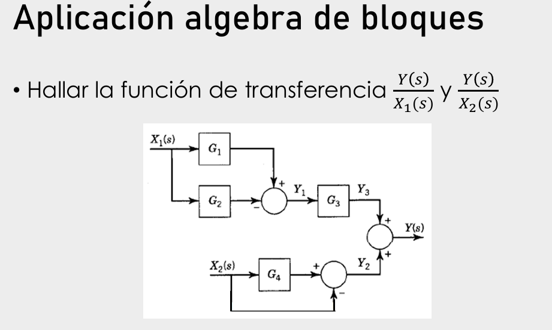
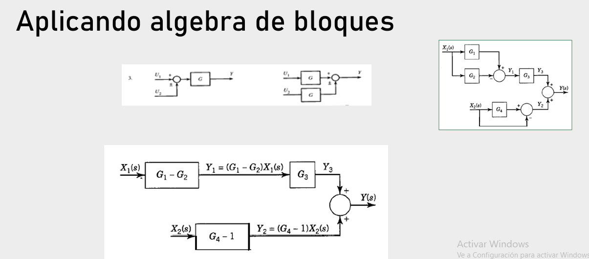

##📚 8. Ejercicios

Solucion

Con respecto al valor inicial de la señal se puede observar que sobra $G_1$ en el último sumando. Para resolver esto se dividirá el bloque $H_2$ entre $G_1$.

Resolviendo el bucle interno:

$$M_1(s) = \frac{G_1 G_2}{1 - G_1 G_2 H_1}$$

Con lo que el diagrama de bloques ahora será:

Resolviendo el lazo interno entre a y c:

$$M_2(s) = \frac{\frac{G_1 G_2 G_3}{1 - G_1 G_2 H_1}}{1 + \frac{G_1 G_2 G_3}{1 - G_1 G_2 H_1} \cdot \frac{H_2}{G_1}} = \frac{G_1 G_2 G_3}{1 - G_1 G_2 H_1 + G_2 G_3 H_2}$$

Y resolviendo el último lazo:

$$M_3(s) = \frac{\frac{G_1 G_2 G_3}{1 - G_1 G_2 H_1 + G_2 G_3 H_2}}{1 + \frac{G_1 G_2 G_3}{1 - G_1 G_2 H_1 + G_2 G_3 H_2}} = \frac{G_1 G_2 G_3}{1 - G_1 G_2 H_1 + G_2 G_3 H_2 + G_1 G_2 G_3}$$

Este es el diagrama de bloques final:

##📚 8.2 Ejercicio

Solución

Resolviendo el lazo interno entre a y c:

$$M_2(s) = \frac{\frac{G_1 G_2 G_3}{1 - G_1 G_2 H_1}}{1 + \frac{G_1 G_2 G_3}{1 - G_1 G_2 H_1} \cdot \frac{H_2}{G_1}} = \frac{G_1 G_2 G_3}{1 - G_1 G_2 H_1 + G_2 G_3 H_2}$$

Y resolviendo el último lazo:

$$
M_3(s) = \frac{\frac{G_1 G_2 G_3}{1 - G_1 G_2 H_1 + G_2 G_3 H_2}}{1 + \frac{G_1 G_2 G_3}{1 - G_1 G_2 H_1 + G_2 G_3 H_2}} = \frac{G_1 G_2 G_3}{1 - G_1 G_2 H_1 + G_2 G_3 H_2 + G_1 G_2 G_3}
$$

Este es el diagrama de bloques final:

Para el segundo diagrama de bloques, la función de transferencia $\frac{C(s)}{R(s)}$ se obtiene por reducción de bloques como sigue:

$$\frac{C(s)}{R(s)} = \frac{G_1 G_2 G_3}{1 + G_2 H_1 + G_2 H_2 + G_1 G_2 G_3 H_3}$$

## 9. Codigo en Matlab 
////////////////////////////////////////
% Definir la función de transferencia
s = tf('s'); % Variable de Laplace
G = (10) / (s^2 + 5*s + 10); % Ejemplo de una función de transferencia 

% Simular la respuesta al impulso
t = 0:0.01:5; % Tiempo de simulación
u = ones(size(t)); % Entrada tipo escalón
y = lsim(G, u, t); % Salida del sistema

% Mostrar la salida del sistema (Torque)
figure;
plot(t, y);
xlabel('Tiempo (s)');
ylabel('Torque generado');
title('Respuesta del sistema');
grid on;

Grafica de la respuesta del sistema

## 10. Conclusiones

Se ha comprendido y aplicado una metodología sistemática para simplificar diagramas de bloques complejos, resolviendo lazos internos paso a paso y combinando bloques en serie para obtener la función de transferencia 

la identificación y aplicación de fórmulas específicas para lazos de retroalimentación y la combinación de bloques en serie para obtener una representación simplificada.

## 11. Referencias

Modern Control Engineering, Katsuhiko Ogata, Second Edition.

Jorge Eduardo Cote , Algebra de Bloques ETTIC 

 

